# VaporFund Visual Guide

## Simple Architecture Diagrams for External Audiences

This document contains simplified visual diagrams designed for investors, partners, and general audiences.

## 1. How VaporFund Works (Simple Overview)

**What it shows:** The complete user journey from wallet connection to staking, showing how funds are secured in a MultiSig vault and tracked in real-time on the Ethereum blockchain. Partners can integrate staking into their own platforms via the Vapor Dashboard.

```mermaid
graph LR
    subgraph Users
        U["👤 Direct Users"]
        P["🤝 Partners"]
    end

    subgraph Platform["VaporFund Platform"]
        WEB["🌐 Web App - Easy Interface"]
        PORTAL["👥 Vapor Dashboard - API & Widgets"]
        API["⚡ Smart Engine - AI-Powered"]
    end

    subgraph Security
        SAFE["🔐 MultiSig Vault - Your Funds Protected"]
    end

    subgraph Blockchain
        ETH["⛓️ Ethereum - Transparent & Secure"]
    end

    U -->|1. Connect Wallet| WEB
    P -->|Integrate| PORTAL
    WEB -->|2. Stake Tokens| API
    PORTAL -->|API/Widgets| API
    API -->|3. Secured in| SAFE
    SAFE -->|4. On-Chain| ETH
    ETH -.Real-time tracking.-> WEB
    ETH -.Analytics.-> PORTAL
    WEB -.Dashboard.-> U
    PORTAL -.Commissions & Stats.-> P

    style U fill:#e8e8e8,stroke:#333,stroke-width:2px,color:#000
    style P fill:#d8d8d8,stroke:#333,stroke-width:2px,color:#000
    style PORTAL fill:#d0d0d0,stroke:#333,stroke-width:2px,color:#000
    style SAFE fill:#b0b0b0,stroke:#333,stroke-width:3px,color:#000
    style ETH fill:#d0d0d0,stroke:#333,stroke-width:2px,color:#000
```

---

## 2. Your Money is Safe (Security Model)

**What it shows:** The multi-layered security architecture where deposits are immediately transferred from smart contracts to a 2-of-3 MultiSig wallet, ensuring no single person can access funds without multiple approvals.

```mermaid
flowchart TB
    subgraph Deposit["Your Deposit"]
        USER[💰 Your Crypto]
    end

    subgraph Protection["Instant Protection"]
        CONTRACT[📝 Smart Contract<br/>Verified Code]
        MULTISIG[🔒 MultiSig Wallet<br/>2-of-3 Signatures Required]
    end

    subgraph Security["No Single Point of Failure"]
        KEY1[🔑 Signer 1]
        KEY2[🔑 Signer 2]
        KEY3[🔑 Signer 3]
    end

    subgraph Notes["Security Features"]
        N1["❌ Funds NEVER held in contract"]
        N2["✅ Requires 2 signatures to move"]
        N3["✅ No single person can access funds"]
    end

    USER -->|1. Deposit| CONTRACT
    CONTRACT -->|2. Instantly Transferred| MULTISIG

    MULTISIG ---|Must approve| KEY1
    MULTISIG ---|Must approve| KEY2
    MULTISIG ---|Must approve| KEY3

    style USER fill:#e8e8e8,stroke:#333,stroke-width:2px,color:#000
    style CONTRACT fill:#d0d0d0,stroke:#333,stroke-width:2px,color:#000
    style MULTISIG fill:#b0b0b0,stroke:#333,stroke-width:4px,color:#000
    style KEY1 fill:#c0c0c0,stroke:#333,stroke-width:2px,color:#000
    style KEY2 fill:#c0c0c0,stroke:#333,stroke-width:2px,color:#000
    style KEY3 fill:#c0c0c0,stroke:#333,stroke-width:2px,color:#000
    style N1 fill:#ffe6e6,stroke:#cc0000,stroke-width:2px,color:#000
    style N2 fill:#e6ffe6,stroke:#00cc00,stroke-width:2px,color:#000
    style N3 fill:#e6ffe6,stroke:#00cc00,stroke-width:2px,color:#000
```

---

## 3. Simple User Journey

**What it shows:** A step-by-step timeline of the staking experience, from initial wallet connection (1 minute) to earning rewards and withdrawing funds, emphasizing the platform's simplicity and speed.


---

## 4. What You Can Stake

**What it shows:** The current and planned token support, starting with USDC stablecoin (live now) and expanding to ETH, USDT, and yield-bearing tokens in 2026, demonstrating the platform's multi-asset vision.

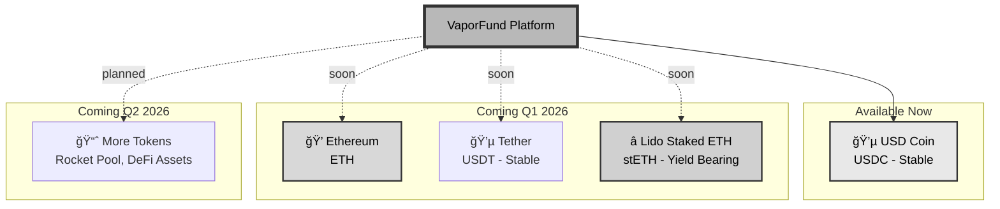

---

## 5. Growth Roadmap (2025-2026)

**What it shows:** The platform's development timeline from Q4 2025 launch through Q4 2026, highlighting key milestones including mobile app, DeFi integrations, institutional features, and AI-powered optimization.


---

## 6. Technology Partners

**What it shows:** VaporFund's ecosystem of security and infrastructure partners including OpenZeppelin, Gnosis Safe, Google Cloud, and Ethereum, plus future integrations with Lido, EtherFi, and Fireblocks.

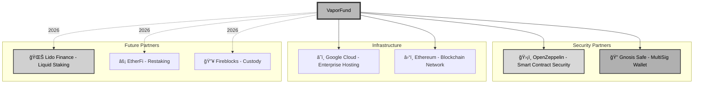

---

## 7. Multiple Layers of Security

**What it shows:** The four-layer defense system protecting user funds: audited smart contracts, 2-of-3 MultiSig protection, enterprise infrastructure, and real-time monitoring with instant alerts.

```mermaid
graph TD
    subgraph Layer1["Layer 1: Smart Contracts"]
        SC["✅ Audited Code<br>✅ Battle-Tested Patterns<br>✅ No Upgrades = No Backdoors"]
    end

    subgraph Layer2["Layer 2: MultiSig Protection"]
        MS["✅ 2-of-3 Signatures Required<br>✅ Distributed Keys<br>✅ No Single Control Point"]
    end

    subgraph Layer3["Layer 3: Enterprise Infrastructure"]
        INF["✅ Google Cloud Security<br>✅ 24/7 Monitoring<br>✅ Automatic Backups"]
    end

    subgraph Layer4["Layer 4: Real-Time Monitoring"]
        MON["✅ Instant Alerts<br>✅ Anomaly Detection<br>✅ Transparent Tracking"]
    end

    SC --> MS
    MS --> INF
    INF --> MON

    SAFE["ğŸ›¡ï¸ Your Funds Are Protected"]
    MON --> SAFE

    style SC fill:#d8d8d8,stroke:#333,stroke-width:2px,color:#000
    style MS fill:#b0b0b0,stroke:#333,stroke-width:2px,color:#000
    style INF fill:#e8e8e8,stroke:#333,stroke-width:2px,color:#000
    style MON fill:#d0d0d0,stroke:#333,stroke-width:2px,color:#000
    style SAFE fill:#b8b8b8,stroke:#333,stroke-width:4px,color:#000
```

---

## 8. Market Opportunity

**What it shows:** The competitive advantage of DeFi over traditional banking, comparing VaporFund's 3-15%+ APY, instant access, and transparency against banks' 0.01-2% rates and limited accessibility.

```mermaid
graph LR
    subgraph TradFi["Traditional Finance"]
        BANKS["🦠Banks<br>0.01% - 2% APY<br>Limited Access"]
    end

    subgraph DeFi["VaporFund DeFi"]
        VF["â­ VaporFund<br>3% - 15%+ APY<br>Open to Everyone"]
    end

    subgraph Benefits["Why DeFi Wins"]
        BENEFIT1["✅ Higher Returns"]
        BENEFIT2["✅ Full Control"]
        BENEFIT3["✅ Transparent"]
        BENEFIT4["✅ No Middlemen"]
    end

    BANKS -.Outdated.-> VF
    VF --> BENEFIT1
    VF --> BENEFIT2
    VF --> BENEFIT3
    VF --> BENEFIT4

    style BANKS fill:#e0e0e0,stroke:#333,stroke-width:1px,color:#000
    style VF fill:#b8b8b8,stroke:#333,stroke-width:4px,color:#000
    style BENEFIT1 fill:#e8e8e8,stroke:#333,stroke-width:2px,color:#000
```

---

## 9. How We Make Money (Business Model)

**What it shows:** The transparent revenue model where 90% of yield goes to users and 10% is retained by VaporFund for platform improvements, security audits, and feature development.

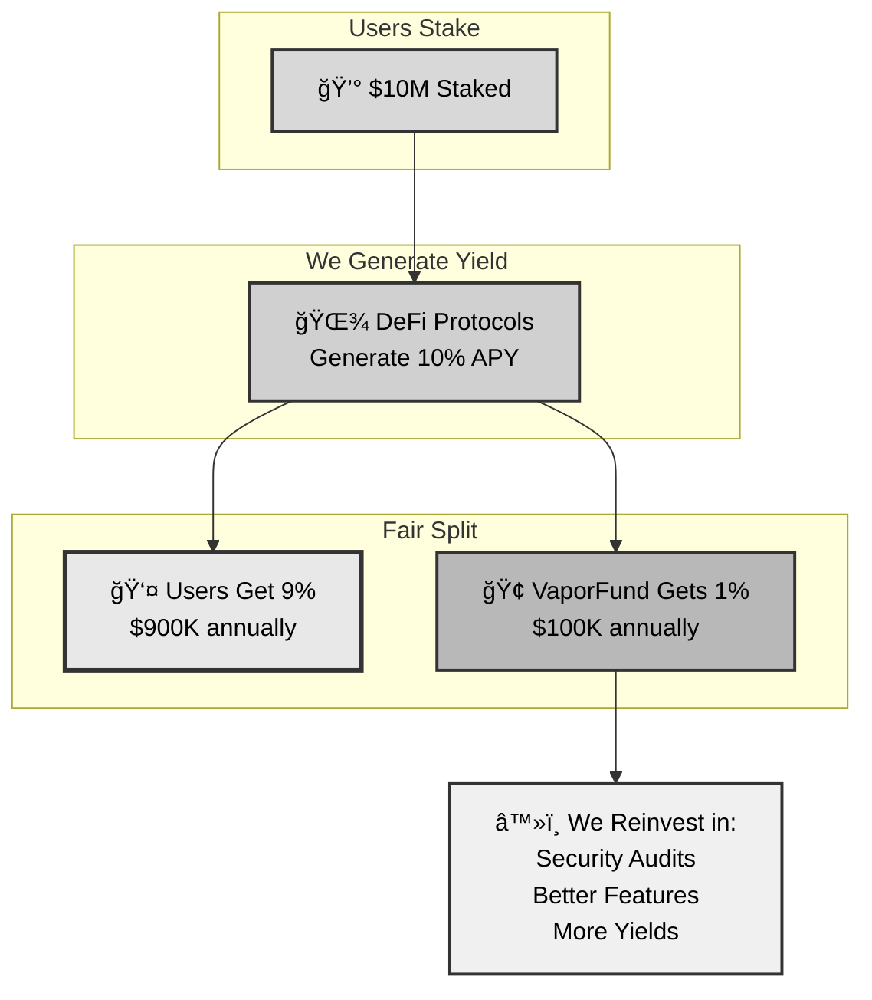

---

## 10. Competitive Advantages

**What it shows:** VaporFund's key differentiators including MultiSig security (not held in contracts), multi-token support, upcoming AI optimization, enterprise-grade infrastructure, and user-friendly interface.


---

## 11. Partner Integration Ecosystem

**What it shows:** The comprehensive partner portal system enabling external developers and businesses to integrate VaporFund staking through APIs, embeddable widgets, and affiliate programs, with real-time analytics and commission tracking.

```mermaid
graph TB
    subgraph Partners["External Partners"]
        PARTNER["🤝 Partner Business<br>Website/App"]
    end

    subgraph Portal["Vapor Dashboard (port 3003)"]
        LOGIN["🔐 Authentication<br>SIWE + OAuth2"]
        DASHBOARD["📊 Analytics Dashboard<br>Real-time Stats"]
        APIKEYS["🔑 API Key Management<br>Create & Revoke Keys"]
        AFFILIATE["💰 Affiliate Program<br>Track Commissions"]
        WIDGETS["🎨 Widget Builder<br>Embeddable Components"]
    end

    subgraph Integration["Integration Options"]
        API["⚡ REST API<br>Backend Integration"]
        EMBED["🌐 Widgets<br>Staking, Dashboard, Banner"]
        LINKS["🔗 Affiliate Links<br>Campaign Tracking"]
    end

    subgraph Backend["VaporFund Backend"]
        BE_API["🔧 Backend API<br>Data & Business Logic"]
    end

    PARTNER -->|Access| LOGIN
    LOGIN --> DASHBOARD
    LOGIN --> APIKEYS
    LOGIN --> AFFILIATE
    LOGIN --> WIDGETS

    APIKEYS --> API
    WIDGETS --> EMBED
    AFFILIATE --> LINKS

    API --> BE_API
    EMBED --> BE_API
    LINKS --> BE_API

    BE_API -.Track Usage.-> DASHBOARD
    BE_API -.Calculate Commissions.-> AFFILIATE

    style PARTNER fill:#e8e8e8,stroke:#333,stroke-width:2px,color:#000
    style LOGIN fill:#b0b0b0,stroke:#333,stroke-width:2px,color:#000
    style DASHBOARD fill:#d8d8d8,stroke:#333,stroke-width:2px,color:#000
    style API fill:#d0d0d0,stroke:#333,stroke-width:2px,color:#000
    style EMBED fill:#e8e8e8,stroke:#333,stroke-width:2px,color:#000
    style BE_API fill:#b8b8b8,stroke:#333,stroke-width:3px,color:#000
```

### Partner Benefits

**What it shows:** The value proposition for partners including revenue sharing, white-label options, technical support, and enterprise-grade infrastructure.

```mermaid
graph TB
    PORTAL["⭐ Vapor Dashboard"]

    subgraph Benefits["What Partners Get"]
        REV["💰 Revenue Sharing<br>Earn commissions on referrals"]
        API_ACCESS["🔌 API Access<br>Full backend integration"]
        WIDGETS_B["🎨 White-Label Widgets<br>Embed on your site"]
        ANALYTICS["📊 Real-Time Analytics<br>Track performance"]
        SUPPORT["🛠️ Developer Support<br>Technical assistance"]
        ENTERPRISE["🏢 Enterprise Ready<br>Scalable infrastructure"]
    end

    subgraph Features["Key Features"]
        F1["✅ Multiple widget types"]
        F2["✅ Custom branding options"]
        F3["✅ Usage tracking & metrics"]
        F4["✅ Commission automation"]
        F5["✅ One-time key display"]
        F6["✅ Campaign tracking"]
    end

    PORTAL --> REV
    PORTAL --> API_ACCESS
    PORTAL --> WIDGETS_B
    PORTAL --> ANALYTICS
    PORTAL --> SUPPORT
    PORTAL --> ENTERPRISE

    REV --> F4
    API_ACCESS --> F3
    WIDGETS_B --> F1
    WIDGETS_B --> F2
    ANALYTICS --> F3
    SUPPORT --> F5
    ENTERPRISE --> F6

    style PORTAL fill:#b8b8b8,stroke:#333,stroke-width:4px,color:#000
    style REV fill:#b0b0b0,stroke:#333,stroke-width:2px,color:#000
    style API_ACCESS fill:#d8d8d8,stroke:#333,stroke-width:2px,color:#000
    style WIDGETS_B fill:#d0d0d0,stroke:#333,stroke-width:2px,color:#000
    style ANALYTICS fill:#e8e8e8,stroke:#333,stroke-width:2px,color:#000
```

### Widget Integration Flow

**What it shows:** The simple process for partners to embed VaporFund staking widgets on their websites, from creating the widget in the portal to displaying it live with full tracking.

```
Partner Creates Widget in Portal
    ↓
[Vapor Dashboard - Widget Builder]
    ↓
Generate Embed Code
    ↓
<script src="https://cdn.vaporfund.com/widget.js"></script>
<div data-vaporfund-widget="staking" data-api-key="..."></div>
    ↓
[Partner Embeds on Their Website]
    ↓
[Users Stake Directly on Partner Site]
    ↓
[📊 Analytics & Commissions Tracked Automatically]
```

---

## 12. User Referrals Program

**What it shows:** The built-in referral system that allows users to earn rewards by inviting friends to stake on VaporFund, creating a viral growth loop with leaderboards and bonus incentives.

```mermaid
graph TB
    subgraph Referrer["👤 You (Referrer)"]
        USER["Existing User<br>Staking on VaporFund"]
    end

    subgraph Share["📤 Share & Invite"]
        LINK["🔗 Generate Referral Link<br>vaporfund.com/r/ABC123"]
        SOCIAL["📱 Share via Social<br>Twitter, Telegram, Discord"]
    end

    subgraph Friend["👥 Your Friends (Referees)"]
        FRIEND1["Friend 1<br>Clicks Link"]
        FRIEND2["Friend 2<br>Clicks Link"]
        FRIEND3["Friend 3<br>Clicks Link"]
    end

    subgraph Action["⚡ Friends Stake"]
        STAKE["💰 Complete First Stake<br>Minimum $100 USDC/ETH"]
    end

    subgraph Rewards["🎁 Earn Rewards"]
        YOU_EARN["💎 You Earn:<br>5% of friend's staking amount"]
        FRIEND_EARN["🎉 Friend Earns:<br>Bonus 2% on first stake"]
    end

    subgraph Tracking["📊 Track Performance"]
        DASH["Dashboard<br>View referrals & earnings"]
        LEADER["🏆 Leaderboard<br>Compete for top spots"]
    end

    USER --> LINK
    LINK --> SOCIAL
    SOCIAL --> FRIEND1
    SOCIAL --> FRIEND2
    SOCIAL --> FRIEND3

    FRIEND1 --> STAKE
    FRIEND2 --> STAKE
    FRIEND3 --> STAKE

    STAKE --> YOU_EARN
    STAKE --> FRIEND_EARN

    YOU_EARN --> DASH
    DASH --> LEADER

    style USER fill:#e8e8e8,stroke:#333,stroke-width:2px,color:#000
    style LINK fill:#d0d0d0,stroke:#333,stroke-width:2px,color:#000
    style STAKE fill:#b0b0b0,stroke:#333,stroke-width:2px,color:#000
    style YOU_EARN fill:#b8b8b8,stroke:#333,stroke-width:3px,color:#000
    style FRIEND_EARN fill:#d8d8d8,stroke:#333,stroke-width:2px,color:#000
    style LEADER fill:#e0e0e0,stroke:#333,stroke-width:2px,color:#000
```

### Referral Rewards Structure

**What it shows:** The tiered reward system where both referrers and referees benefit, with bonus multipliers for top performers and special campaigns.

```mermaid
graph TB
    subgraph Tiers["🎯 Referral Tiers"]
        T1["🥉 Bronze Tier<br>1-9 referrals<br>5% reward"]
        T2["🥈 Silver Tier<br>10-49 referrals<br>7% reward"]
        T3["🥇 Gold Tier<br>50-99 referrals<br>10% reward"]
        T4["💎 Diamond Tier<br>100+ referrals<br>15% reward + bonuses"]
    end

    subgraph Benefits["✨ Additional Benefits"]
        B1["🎁 Welcome Bonus<br>First 3 referrals get extra 1%"]
        B2["📅 Monthly Competitions<br>Top 10 win cash prizes"]
        B3["🏆 Annual Leaderboard<br>Top 3 win exclusive badges"]
        B4["⚡ Flash Campaigns<br>Limited-time 2x rewards"]
    end

    subgraph Example["💰 Example Earnings"]
        EX["Friend stakes $1,000 USDC<br>↓<br>You earn: $50-$150<br>Friend earns: $20 bonus<br>↓<br>Paid instantly in USDC"]
    end

    T1 --> T2
    T2 --> T3
    T3 --> T4

    T4 --> B1
    T4 --> B2
    T4 --> B3
    T4 --> B4

    B1 --> EX
    B2 --> EX
    B3 --> EX
    B4 --> EX

    style T1 fill:#d8d8d8,stroke:#333,stroke-width:2px,color:#000
    style T2 fill:#d0d0d0,stroke:#333,stroke-width:2px,color:#000
    style T3 fill:#c8c8c8,stroke:#333,stroke-width:2px,color:#000
    style T4 fill:#b0b0b0,stroke:#333,stroke-width:3px,color:#000
    style EX fill:#e8e8e8,stroke:#333,stroke-width:2px,color:#000
```

### How Referral Tracking Works

**What it shows:** The technical implementation of referral tracking from link generation to reward distribution, ensuring transparency and accurate attribution.


### Leaderboard & Competition System

**What it shows:** The gamification elements that encourage user engagement through competitive leaderboards, rankings, and special prizes.

```mermaid
graph TB
    subgraph Rankings["🏆 Leaderboard Rankings"]
        DAILY["📅 Daily Leaderboard<br>Top 10 users<br>Updated hourly"]
        WEEKLY["📆 Weekly Leaderboard<br>Top 25 users<br>Resets Monday"]
        MONTHLY["📊 Monthly Leaderboard<br>Top 50 users<br>Winner announced 1st"]
        ALLTIME["⭐ All-Time Leaders<br>Hall of Fame<br>Lifetime tracking"]
    end

    subgraph Prizes["🎁 Competition Prizes"]
        P1["🥇 1st Place<br>$500 USDC + Exclusive Badge"]
        P2["🥈 2nd Place<br>$300 USDC"]
        P3["🥉 3rd Place<br>$200 USDC"]
        P4["🎖️ 4th-10th<br>$50 USDC each"]
    end

    subgraph Display["📱 Dashboard Features"]
        D1["📈 Real-time rank updates"]
        D2["📊 Referral statistics"]
        D3["💰 Total earnings"]
        D4["🔔 Achievement notifications"]
        D5["📜 Referral history"]
    end

    DAILY --> P1
    WEEKLY --> P2
    MONTHLY --> P3
    ALLTIME --> P4

    P1 --> D1
    P2 --> D2
    P3 --> D3
    P4 --> D4
    D4 --> D5

    style DAILY fill:#d8d8d8,stroke:#333,stroke-width:2px,color:#000
    style MONTHLY fill:#d0d0d0,stroke:#333,stroke-width:2px,color:#000
    style P1 fill:#b0b0b0,stroke:#333,stroke-width:3px,color:#000
    style P2 fill:#c0c0c0,stroke:#333,stroke-width:2px,color:#000
    style P3 fill:#c8c8c8,stroke:#333,stroke-width:2px,color:#000
    style D1 fill:#e8e8e8,stroke:#333,stroke-width:2px,color:#000
```

### Simple Referral Flow

**What it shows:** A simplified step-by-step process showing how easy it is for users to refer friends and start earning rewards immediately.

```
User Journey: From Share to Earn

1️⃣ Get Your Link
   [Dashboard] → "Referrals" → "Get Link"
   → Copy: vaporfund.com/r/ABC123

2️⃣ Share Everywhere
   📱 Twitter/X
   💬 Telegram groups
   🎮 Discord servers
   ✉️ Email to friends
   📝 Blog posts

3️⃣ Friend Signs Up
   Clicks your link → Connects wallet
   → Stakes $500 USDC

4️⃣ Instant Rewards
   ✅ You earn: $25 USDC (5%)
   ✅ Friend earns: $10 bonus (2%)
   ✅ Leaderboard: Move up 5 spots

5️⃣ Keep Growing
   Track stats in real-time
   → Climb leaderboard tiers
   → Unlock higher rewards
   → Win monthly competitions
```

### Key Features Summary

**What it shows:** Overview of all referral program features ensuring transparency, fairness, and maximum earning potential for users.


---

## Simple Infographics (Text-Based)

### The VaporFund Difference

```
┌─────────────────────────────────────────────────────┐
│                                                     │
│  TRADITIONAL BANKS          →        VAPORFUND     │
│                                                     │
│  🏦 0.01% - 2% APY          →    ⭐ 3% - 15%+ APY  │
│  🔒 Your money locked       →    🔓 Withdraw anytime│
│  ❓ Hidden fees             →    ✅ Transparent     │
│  📞 Business hours only     →    🌐 24/7 access     │
│  🐌 Slow transfers          →    ⚡ Instant         │
│  👔 Minimum $10,000         →    💰 Start with $101 │
│                                                     │
└─────────────────────────────────────────────────────┘
```

### Simple Security Flow

```
Your Crypto
    ↓
[Smart Contract - Verified & Audited]
    ↓
[MultiSig Wallet - 2 of 3 Keys Required]
    ↓
[🔐 SAFE - No Single Person Can Access]
```

### Growth Timeline

```
Q4 2025 ━━━━━━━━━┓
                 ┃  ✅ Launch Platform
                 ┃  ✅ ETH Staking Live
                 ┃
Q1 2026 ━━━━━━━━━┫  💵 USDC & USDT
                 ┃  🏆 Rewards Program
                 ┃
Q2 2026 ━━━━━━━━━┫  📈 Higher Yields
                 ┃  🔗 DeFi Integration
                 ┃
Q3 2026 ━━━━━━━━━┫  🏢 Enterprise Features
                 ┃  🔐 Advanced Custody
                 ┃
Q4 2026 ━━━━━━━━━┛  🤖 AI Optimization
                    🚀 Smart Portfolios
```

---

## Key Statistics (Visual Elements)

### Market Size

**What it shows:** Distribution of the $40B+ global DeFi market, illustrating VaporFund's addressable market segment and significant growth opportunities in the decentralized finance space.


### User Distribution (Projected 2026)

**What it shows:** Expected user base composition by Q4 2026, targeting 60% retail investors, 25% institutional clients, and 15% enterprise customers, demonstrating broad market appeal.


### Revenue Model

**What it shows:** Fair and transparent fee structure where users receive 90% of generated yields while VaporFund retains 10% for platform operations, security, and continuous improvement.


---

## Related Documentation

**Business Overview:**
- **[[WHITEPAPER]]** - Platform vision, business model, and tokenomics
- **[[SECURITY]]** - Security architecture, audits, and best practices
- **[[ROADMAP]]** - Product roadmap and development milestones

**Earning Opportunities:**
- **[[EARNING]]** - Partner and affiliate earning programs
- **[[REFERRALS]]** - User referral program and rewards

**Main Index:**
- **[[README]]** - Documentation overview and quick start guide

---

**Last Updated**: October 2025
**Version**: 1.0 External
**Audience**: Investors, Partners, Media, General Public
